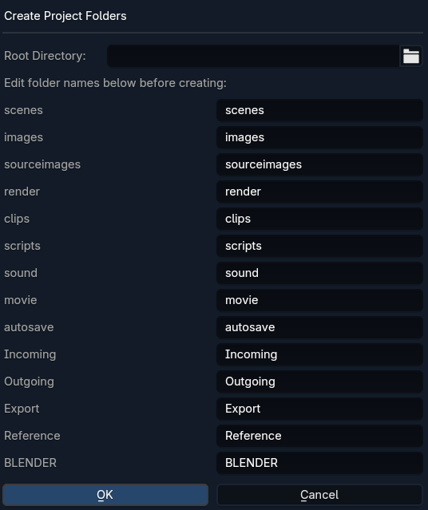

# Blender Project Setup

A Blender addon to create a standard, Maya-inspired project folder structure.

## Purpose

This addon helps you quickly set up a standardized directory structure for your Blender projects, inspired by the folder organization commonly used with Autodesk Maya. This ensures your project files remain organized and easy to navigate.

## Functionality

*   **Create Project Structure**: Generates a set of default folders with a single click.
*   **Customizable**: Allows you to edit the folder names before creation.
*   **Easy Access**: The operator is located in `File > Project Setup`.
*   **Default Folders**: Creates folders like `scenes`, `images`, `sourceimages`, `render`, `scripts`, `Export`, `Reference`, and more.
*   **Workspace File**: Creates an empty `workspace.py` file in the project root, similar to Maya's `workspace.mel`.

## Installation

1.  Download the latest release as a `.zip` file.
2.  In Blender, go to `Edit > Preferences > Add-ons`.
3.  Click `Install...` and select the downloaded `.zip` file.
4.  Enable the "Project Setup" addon by checking the box next to its name.
